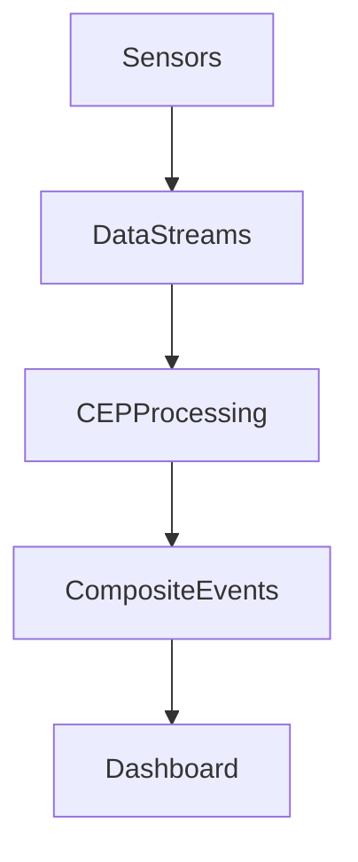

# IoT Real-Time Stream Processing System using OpenHAB

## Project Description

This project demonstrates a **Real-Time IoT Stream Processing system** implemented using OpenHAB Rules.

The system processes multiple IoT data streams and performs **Complex Event Processing (CEP)** to detect patterns and generate composite events.

Sensor data streams are simulated in real time and processed through a rule engine to identify environmental conditions and trigger alerts.

---

## System Architecture

---

## Data Streams

The system processes multiple real-time streams:

* Temperature stream
* Humidity stream
* Light level stream

Each stream continuously generates values using OpenHAB rules to simulate IoT devices.

---

## Complex Event Processing (CEP)

The system analyzes streams and detects patterns using CEP rules.

Examples of composite events:

### HotHumidAlert

Triggered when:

* Temperature > 27°C
* Humidity > 75%

### DarkRoomEvent

Triggered when:

* Light level < 80 lx

### ComfortState

Evaluates environmental comfort conditions based on temperature and humidity ranges.

---

## OpenHAB Configuration

The system uses the following configuration files:

items/
stream_items.items

rules/
stream_simulation.rules
cep.rules

sitemaps/
stream_dashboard.sitemap

---

## Dashboard

The dashboard visualizes:

* real-time data streams
* sensor values
* detected complex events

Dashboard URL:

http://localhost:8080/basicui/app?sitemap=stream_dashboard

---

## Real-Time Processing Workflow

1. Sensor data streams are generated in real time.
2. Streams are processed using OpenHAB rules.
3. CEP logic analyzes correlations between streams.
4. Composite events are generated when specific conditions occur.
5. Results are visualized in the dashboard.

---

## Demo

The demonstration shows:

* multiple data streams updating in real time
* complex event detection
* correlation between sensor streams
* visualization of composite events

---

# Система Real-Time Stream Processing для IoT з використанням OpenHAB

## Опис проєкту

Цей проєкт демонструє систему **обробки потоків IoT даних у реальному часі**, реалізовану за допомогою правил OpenHAB.

Система обробляє декілька потоків даних та виконує **Complex Event Processing (CEP)** для виявлення подій та закономірностей.

Потоки даних генеруються автоматично для імітації роботи реальних IoT сенсорів.

---

## Архітектура системи

---

## Потоки даних

У системі використовуються кілька потоків даних:

* потік температури
* потік вологості
* потік освітлення

Дані генеруються у реальному часі за допомогою OpenHAB Rules.

---

## Complex Event Processing (CEP)

Система аналізує потоки даних та визначає події на основі заданих правил.

Приклади composite events:

### HotHumidAlert

Виникає коли:

* температура > 27°C
* вологість > 75%

### DarkRoomEvent

Виникає коли:

* рівень освітлення < 80 lx

### ComfortState

Оцінює комфортність середовища на основі температури та вологості.

---

## Конфігурація OpenHAB

У проєкті використовуються такі файли:

items/
stream_items.items

rules/
stream_simulation.rules
cep.rules

sitemaps/
stream_dashboard.sitemap

---

## Dashboard

Dashboard відображає:

* потоки даних у реальному часі
* значення сенсорів
* виявлені комплексні події

Адреса dashboard:

http://localhost:8080/basicui/app?sitemap=stream_dashboard

---

## Логіка роботи системи

1. Потоки даних генеруються сенсорами.
2. Дані передаються до OpenHAB.
3. CEP правила аналізують потоки та визначають події.
4. Генеруються composite events.
5. Результати відображаються у dashboard.

---

## Демонстрація

Під час демонстрації показується:

* генерація потоків даних
* обробка подій у реальному часі
* кореляція між потоками даних
* відображення complex events
