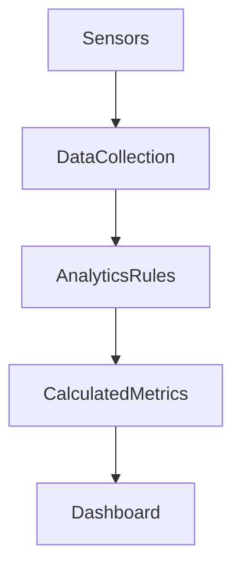

# IoT Multi-Sensor Analytics System using OpenHAB

## Project Description

This project demonstrates a **Time-Series IoT Analytics system** implemented using OpenHAB.

The system collects data from multiple virtual IoT sensors and performs **real-time analytics** using OpenHAB Rules.
Sensor values are simulated to demonstrate how IoT data can be processed, analyzed, and visualized.

The main goal of this project is to implement **basic time-series analytics**, including statistical calculations and trend detection.

---

## System Architecture

---

## Sensors

The system simulates several IoT sensors:

* Temperature sensor
* Humidity sensor
* Light sensor

Sensor data is generated automatically using OpenHAB Rules to simulate real-world sensor behavior.

---

## Analytics Features

The system performs several analytical operations:

### Statistical Calculations

* Average temperature
* Maximum temperature
* Minimum temperature
* Average humidity

### Trend Detection

The system determines the **temperature trend direction**:

* UP – temperature increasing
* DOWN – temperature decreasing
* STABLE – no significant change

---

## OpenHAB Configuration

The project includes the following configuration files:

items/
analytics_items.items

rules/
sensor_simulation.rules
analytics.rules

sitemaps/
analytics_dashboard.sitemap

---

## Dashboard

The dashboard visualizes:

* real-time sensor values
* statistical metrics
* trend detection results

Dashboard URL:

http://localhost:8080/basicui/app?sitemap=analytics_dashboard

---

## Demo

The demonstration shows:

* sensor data simulation
* real-time analytics calculations
* automatic trend detection
* dashboard visualization

---

# Система аналітики IoT сенсорів з використанням OpenHAB

## Опис проєкту

Цей проєкт демонструє систему **аналітики IoT даних у часових рядах** на базі OpenHAB.

Система збирає дані з декількох віртуальних сенсорів та виконує **аналітичну обробку даних у реальному часі** за допомогою правил OpenHAB.

Значення сенсорів генеруються автоматично для демонстрації роботи системи збору та аналізу IoT даних.

Основна мета роботи — реалізація **базової аналітики часових рядів**.

---

## Архітектура системи

---

## Сенсори

У системі використовуються віртуальні IoT сенсори:

* сенсор температури
* сенсор вологості
* сенсор освітлення

Дані генеруються автоматично за допомогою OpenHAB Rules.

---

## Аналітичні можливості

Система виконує такі аналітичні обчислення.

### Статистичні показники

* середня температура
* максимальна температура
* мінімальна температура
* середня вологість

### Визначення тренду

Система визначає напрямок зміни температури:

* UP — температура зростає
* DOWN — температура знижується
* STABLE — без значних змін

---

## Конфігурація OpenHAB

Проєкт містить такі конфігураційні файли:

items/
analytics_items.items

rules/
sensor_simulation.rules
analytics.rules

sitemaps/
analytics_dashboard.sitemap

---

## Dashboard

Dashboard відображає:

* значення сенсорів у реальному часі
* статистичні показники
* результати аналітики

Адреса dashboard:

http://localhost:8080/basicui/app?sitemap=analytics_dashboard

---

## Демонстрація

Під час демонстрації показується:

* симуляція сенсорних даних
* аналітика IoT даних у реальному часі
* визначення трендів
* візуалізація даних у dashboard
