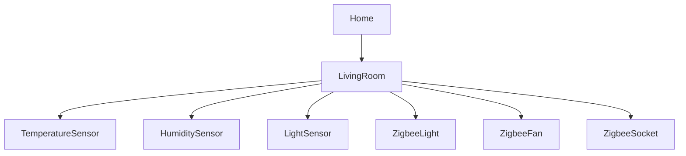

# Semantic IoT System using OpenHAB

## Project Description

This project demonstrates a **Semantic IoT system** implemented using the OpenHAB Semantic Model.

The goal of this project is to demonstrate how IoT devices can be described using **semantic annotations and ontology concepts**.
Semantic tags allow the system to understand the **role and meaning of devices**, not only their technical parameters.

Devices are categorized as:

* Sensors (Temperature, Humidity, Light)
* Actuators (Zigbee Light, Fan, Socket)
* Locations (Home, LivingRoom)

Using semantic annotations makes it possible to implement **ontology-based automation**.

---

## System Architecture

---

## Semantic Model

The project uses the **OpenHAB Semantic Model**, where devices are organized hierarchically.

Example structure:

Home
└ LivingRoom
  ├ Temperature Sensor
  ├ Humidity Sensor
  ├ Light Sensor
  ├ Zigbee Light
  ├ Zigbee Fan
  └ Zigbee Socket

Each device has semantic tags that describe:

* device type
* device capability
* location

This allows the system to perform **semantic reasoning**.

---

## Ontology-Based Automation

Automation rules are based on the meaning of devices in the ontology.

Examples:

* If **temperature > 25°C → turn ON cooling device**
* If **light level < 100 lx → turn ON lighting device**

This demonstrates **semantic interoperability in IoT systems**.

---

## OpenHAB Configuration

The project includes the following configuration files:

items/
iot_devices.items

metadata/
semantic.metadata

rules/
bridge.rules

sitemaps/
iot_dashboard.sitemap

---

## Dashboard

The system dashboard displays:

* sensor values
* device status
* manual device control

Dashboard URL:

http://localhost:8080/basicui/app?sitemap=iot_dashboard

---

## Demo

The demonstration shows:

* semantic device model
* ontology structure
* ontology-based automation
* simulated sensor data

---

# Семантична IoT система з використанням OpenHAB

## Опис проєкту

Цей проєкт демонструє **семантичну IoT систему**, реалізовану за допомогою Semantic Model у OpenHAB.

Метою роботи є показати, як IoT пристрої можуть описуватись за допомогою **семантичних анотацій та онтології**.

Семантичні теги дозволяють системі розуміти **роль та призначення пристроїв**, а не лише їх технічні параметри.

Пристрої поділяються на:

* сенсори (температура, вологість, освітлення)
* виконавчі пристрої (лампа, вентилятор, розетка)
* локації (Home, LivingRoom)

Завдяки цьому можлива **ontology-based automation**.

---

## Архітектура системи

---

## Семантична модель

У проєкті використовується **Semantic Model OpenHAB**, де пристрої організовані ієрархічно.

Приклад структури:

Home
└ LivingRoom
  ├ Sensor Temperature
  ├ Sensor Humidity
  ├ Sensor Light
  ├ Zigbee Light
  ├ Zigbee Fan
  └ Zigbee Socket

Кожен пристрій має semantic tags, які описують:

* тип пристрою
* можливості пристрою
* розташування

Це дозволяє системі використовувати **semantic reasoning**.

---

## Автоматизація на основі онтології

Автоматизація базується на семантичному значенні пристроїв.

Приклади:

* якщо **температура > 25°C → вмикається пристрій охолодження**
* якщо **рівень освітлення < 100 lx → вмикається освітлення**

Це демонструє **семантичну інтероперабельність IoT системи**.

---

## Конфігурація OpenHAB

У проєкті використовуються такі файли:

items/
iot_devices.items

metadata/
semantic.metadata

rules/
bridge.rules

sitemaps/
iot_dashboard.sitemap

---

## Dashboard

Dashboard системи відображає:

* значення сенсорів
* стан пристроїв
* можливість керування пристроями

Адреса dashboard:

http://localhost:8080/basicui/app?sitemap=iot_dashboard

---

## Демонстрація

Під час демонстрації показується:

* semantic модель пристроїв
* структура онтології
* автоматизація на основі онтології
* симуляція сенсорів
