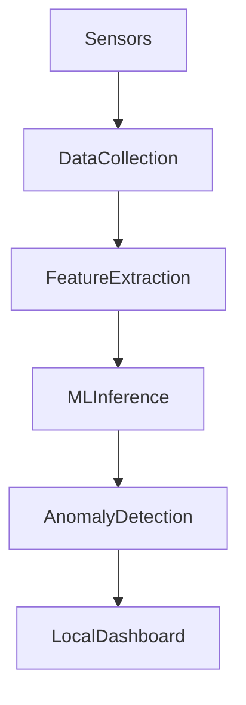

# Edge AI Anomaly Detection using OpenHAB

## Project Description

This project demonstrates an **Edge AI system for anomaly detection** implemented using OpenHAB.

The system integrates a simplified **machine learning inference pipeline on the edge device** to detect abnormal sensor behavior in real time.

Sensor data is processed locally without sending data to cloud services. The system calculates statistical metrics, generates anomaly scores, and triggers alerts when abnormal conditions are detected.

The main objective of this project is to demonstrate **Edge AI integration with IoT automation systems**.

---

## Edge AI Architecture

---

## Sensors

The system uses simulated IoT sensors:

* Temperature sensor
* Humidity sensor
* Light sensor

Sensor data is generated locally using OpenHAB rules.

---

## Edge ML Model

A simplified anomaly detection model is implemented on the edge node.

The model calculates:

* Moving average
* Variance
* Distance from baseline

These metrics are used to generate an **anomaly score**.

---

## Anomaly Detection Logic

The system classifies sensor data as:

* NORMAL — behavior within expected range
* ANOMALY — abnormal deviation detected

Example rule:

Temperature anomaly occurs when the anomaly score exceeds a defined threshold.

---

## OpenHAB Configuration

The project includes the following configuration files:

items/
ml_items.items

rules/
ml_anomaly.rules

scripts/
ml_inference.sim

sitemaps/
ml_dashboard.sitemap

---

## Edge AI Dashboard

The dashboard displays:

* real-time sensor values
* ML model metrics
* anomaly scores
* anomaly status

Dashboard URL:

http://localhost:8080/basicui/app?sitemap=ml_dashboard

---

## Edge AI Workflow

1. Sensors generate environmental data.
2. Data is processed locally on the edge node.
3. ML inference calculates statistical metrics.
4. Anomaly scores are generated.
5. The system classifies the state as normal or anomaly.
6. Results are visualized in the dashboard.

---

## Demo

The demonstration shows:

* real-time sensor data generation
* edge ML inference
* anomaly score calculation
* anomaly detection alerts
* dashboard visualization

---

# Система Edge AI для виявлення аномалій з використанням OpenHAB

## Опис проєкту

Цей проєкт демонструє **Edge AI систему для виявлення аномалій у IoT даних**, реалізовану за допомогою OpenHAB.

Система інтегрує спрощену модель машинного навчання для аналізу сенсорних даних у реальному часі без використання хмарних сервісів.

Дані сенсорів обробляються локально на edge node, де обчислюються статистичні показники та визначаються аномальні значення.

Метою роботи є демонстрація інтеграції **Edge AI та IoT автоматизації**.

---

## Архітектура Edge AI

---

## Сенсори

У системі використовуються такі сенсори:

* сенсор температури
* сенсор вологості
* сенсор освітлення

Дані генеруються локально через OpenHAB rules.

---

## Edge ML модель

У системі використовується спрощена модель для виявлення аномалій.

Модель обчислює:

* середнє значення
* дисперсію
* відхилення від базового значення

Ці показники використовуються для розрахунку **anomaly score**.

---

## Виявлення аномалій

Система класифікує дані як:

* NORMAL — нормальна поведінка
* ANOMALY — виявлено аномальне значення

Наприклад, аномалія температури виникає, якщо значення значно відрізняється від середнього.

---

## Конфігурація OpenHAB

У проєкті використовуються такі файли:

items/
ml_items.items

rules/
ml_anomaly.rules

scripts/
ml_inference.sim

sitemaps/
ml_dashboard.sitemap

---

## Dashboard

Dashboard відображає:

* значення сенсорів
* показники ML моделі
* anomaly score
* статус аномалії

Адреса dashboard:

http://localhost:8080/basicui/app?sitemap=ml_dashboard

---

## Логіка роботи системи

1. Сенсори генерують дані.
2. Дані обробляються локально на edge node.
3. ML inference обчислює статистичні показники.
4. Генерується anomaly score.
5. Система визначає нормальний або аномальний стан.
6. Результати відображаються у dashboard.

---

## Демонстрація

Під час демонстрації показується:

* генерація сенсорних даних
* робота ML моделі на edge
* розрахунок anomaly score
* виявлення аномалій
* візуалізація результатів у dashboard
