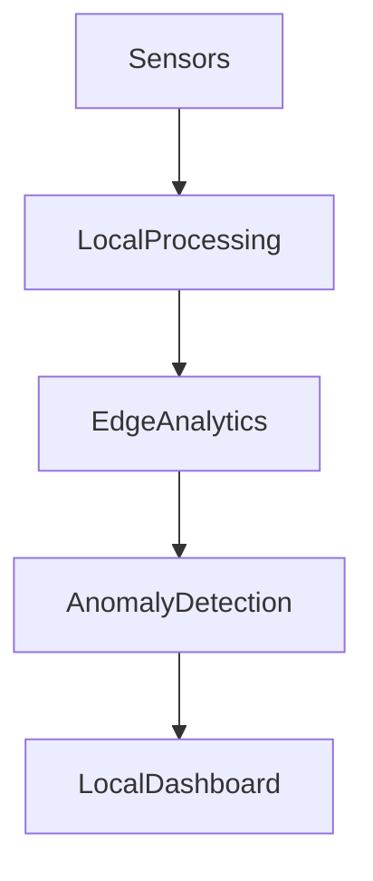

# IoT Edge Analytics Node using OpenHAB

## Project Description

This project demonstrates an **Edge Computing analytics node** implemented using OpenHAB.

The system performs **local data processing and decision-making directly on the edge device**, without relying on external cloud services. Sensor data is analyzed locally, and statistical metrics as well as anomaly detection results are generated in real time.

The main goal of the project is to demonstrate **Edge Analytics principles**, where data is processed close to the data source to reduce latency and network usage.

---

## Edge Architecture

---

## Sensor Data

The system uses simulated IoT sensors:

* Temperature sensor
* Humidity sensor
* Light sensor

These sensors generate data locally using OpenHAB rules.

---

## Edge Analytics Features

The edge node performs several statistical calculations:

* Average temperature
* Maximum temperature
* Minimum temperature
* Temperature variance
* Average humidity

All calculations are executed locally without cloud services.

---

## Anomaly Detection

The system detects abnormal environmental conditions based on predefined thresholds.

Example rules:

* Temperature anomaly if temperature > 30°C or < 15°C
* Humidity anomaly if humidity > 90% or < 20%

This demonstrates **local anomaly detection at the edge**.

---

## OpenHAB Configuration

The project includes the following configuration files:

items/
edge_items.items

rules/
edge_analytics.rules

sitemaps/
edge_dashboard.sitemap

---

## Edge Dashboard

The dashboard displays:

* real-time sensor values
* edge analytics metrics
* anomaly detection status

Dashboard URL:

http://localhost:8080/basicui/app?sitemap=edge_dashboard

---

## Edge Processing Workflow

1. Sensors generate environmental data.
2. Data is processed locally by OpenHAB rules.
3. Statistical metrics are calculated on the edge node.
4. Anomaly detection identifies abnormal values.
5. Results are visualized in the local dashboard.

---

## Demo

The demonstration shows:

* real-time sensor data generation
* local analytics computation
* anomaly detection on the edge device
* dashboard visualization without cloud services

---

# Edge Analytics Node для IoT з використанням OpenHAB

## Опис проєкту

Цей проєкт демонструє **Edge Computing систему для аналітики IoT даних**, реалізовану за допомогою OpenHAB.

Система виконує **локальну обробку даних та прийняття рішень без використання хмарних сервісів**. Дані сенсорів аналізуються безпосередньо на edge node, де обчислюються статистичні показники та визначаються аномалії.

Метою роботи є демонстрація принципів **Edge Analytics**, коли обробка даних відбувається максимально близько до джерела даних.

---

## Архітектура Edge системи

---

## Дані сенсорів

У системі використовуються такі сенсори:

* сенсор температури
* сенсор вологості
* сенсор освітлення

Дані генеруються локально за допомогою OpenHAB Rules.

---

## Edge аналітика

Edge node виконує локальні статистичні обчислення:

* середня температура
* максимальна температура
* мінімальна температура
* дисперсія температури
* середня вологість

Всі обчислення виконуються локально.

---

## Виявлення аномалій

Система визначає аномальні значення на основі порогових значень.

Приклади:

* аномалія температури при значенні > 30°C або < 15°C
* аномалія вологості при значенні > 90% або < 20%

Це демонструє **локальне виявлення аномалій на edge node**.

---

## Конфігурація OpenHAB

У проєкті використовуються такі файли:

items/
edge_items.items

rules/
edge_analytics.rules

sitemaps/
edge_dashboard.sitemap

---

## Dashboard

Dashboard відображає:

* значення сенсорів у реальному часі
* результати edge аналітики
* статус виявлення аномалій

Адреса dashboard:

http://localhost:8080/basicui/app?sitemap=edge_dashboard

---

## Логіка роботи системи

1. Сенсори генерують дані.
2. Дані обробляються локально через OpenHAB rules.
3. Edge node виконує статистичну аналітику.
4. Система визначає аномалії.
5. Результати відображаються у dashboard.

---

## Демонстрація

Під час демонстрації показується:

* генерація даних сенсорів
* локальна аналітика
* виявлення аномалій
* робота системи без cloud сервісів
